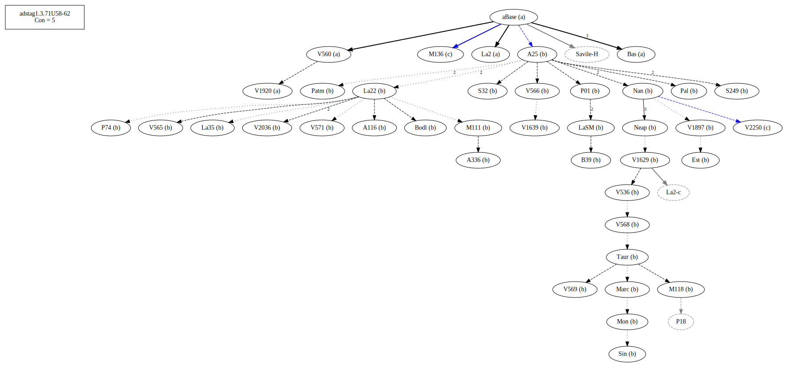
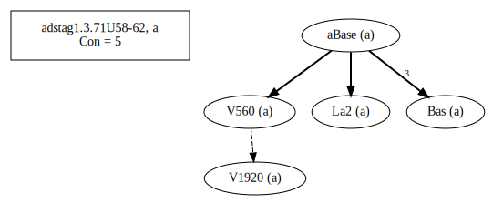
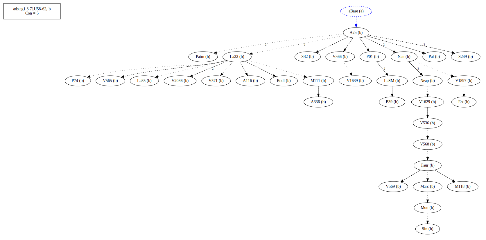
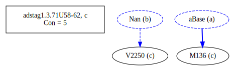
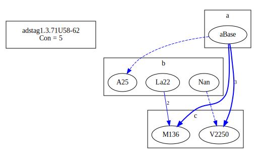
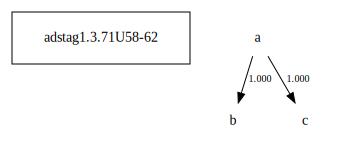

# Variant Analysis: AdStag1.3.71/58-62

Word order

## 📌 Variant Description
- **Location**: adstag1.3.71/58-72
- **Variant Units**: 
  - Reading A: παραδοθῆναι τὸν τοιοῦτον
  - Reading B: τὸν τοιοῦτον παραδοθῆναι
  - Reading C: παραδοῦναι τὸν τοιοῦτον

## 🧬 Manuscript Support
| Reading | Manuscripts | Notes |
|--------|-------------|-------|
| A      | Bas La2 V1920 V560 | Old |
| B      | A116 A25 A336 B39 Bodl Est La22 La35 LaSM M111 M118 Marc Mon Nan Neap P01 P74 Pal Patm S249 S32 Sin Taur V1629 V1639 V1897 V2036 V536 V566 V568 V569 V571    | Most, editions |
| C      | M136 V2250 | late |

## 🧠 Internal Evidence
- **Transcriptional Probability**: [e.g., Reading A is shorter and more difficult]
- **Stylistic/Contextual Fit**: [e.g., Reading B aligns with second sophistic style]

## 🧭 External Evidence
- **Manuscript Age**: [e.g., Reading A supported by earlier MSS]
- **Geographical Spread**: []

## 🔄 Directionality & Genealogy
- **Likely Original Reading**: [e.g., Reading A]
- **Genealogical Relationships**:
  - [e.g., B likely derived from A via harmonization]
  - [e.g., C appears to be a conflation of A and B]
## open-cbgm textual flow ##

## open-cbgm attestations ##
   
   
   
## open-cbgm flow limited to variant readings ##

## Local stemma ##

- **Contamination Notes**: [e.g., Manuscript F shows mixture of A and B]

## 📝 Notes & Decisions
- Followed the oldest, though A25 is also one of them and does not have this reading, nor does La22. Review.

---