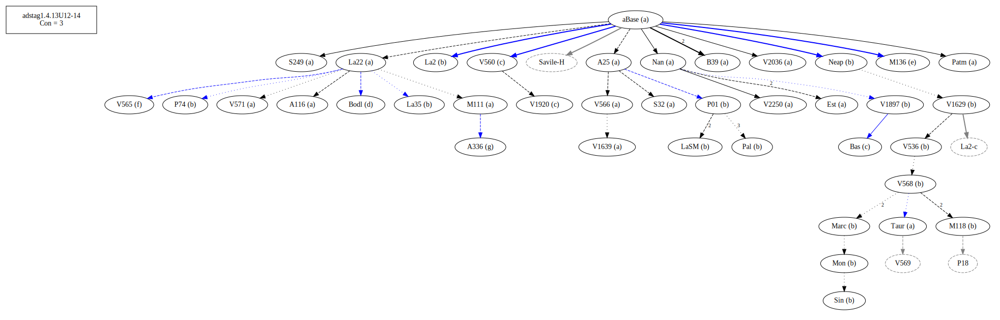
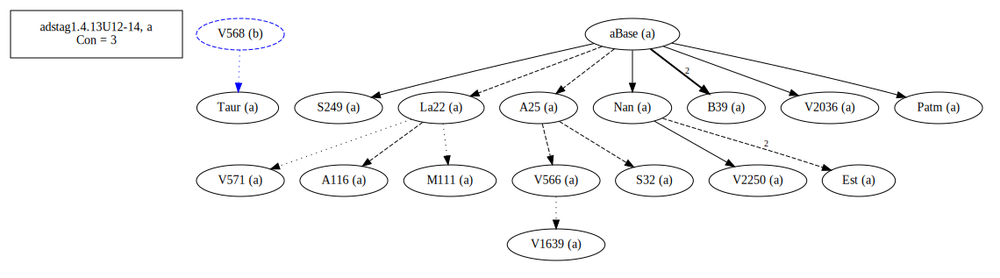
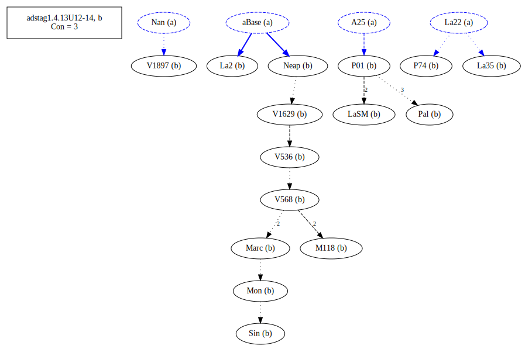
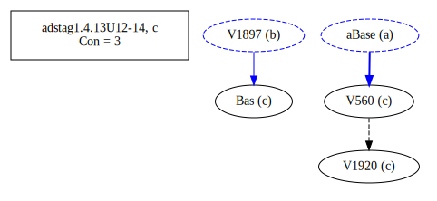
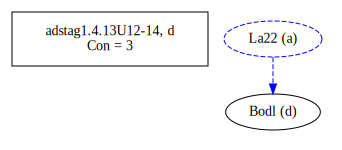
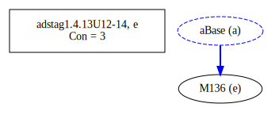
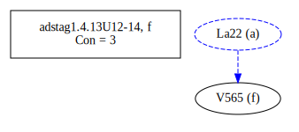
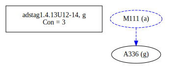
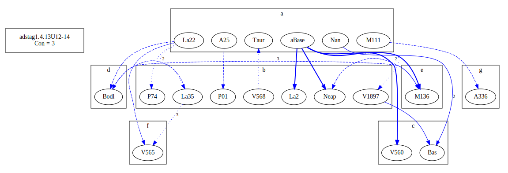
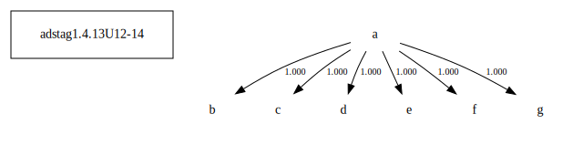

# Variant Analysis: AdStag1.4.13/12-14

## 📌 Variant Description
- **Location**: adstag1.4.13/12-14
- **Variant Units**: 
  - Reading A: κἂν ἠδίκηται
  - Reading B: κἂν ἀδικῆται 
  - Reading C: οὐδὲν ἠδίκηται
  - Reading D: κἂν ἠδίκητο
  - Reading E: ἐὰν ἠδίκηται
  - Reading F: καὶ ἠδίκηται
  - Reading G: εἰ κἂν ἀδικῆται

## 🧬 Manuscript Support
| Reading | Manuscripts | Notes |
|--------|-------------|-------|
| A      | A116 A25 B39 Est La22 M111 Nan Patm S249 S32 Taur V1639 V2036 V2250 V566 V571 | coherence 92.06 |
| B      | La2 La35 LaSM M118 Marc Mon Neap P01 P74 Pal Sin V1629 V1897 V536 V568 | editions, coherence 85.23 |
| C      | Bas V560 V1920 |  |
| D      | Bodl | [lone] |
| E      | M136 | [lone] |
| F      | V565 | [lone] |
| G      | A336 |  |

## 🧠 Internal Evidence
- **Transcriptional Probability**: [e.g., Reading A is shorter and more difficult]
- **Stylistic/Contextual Fit**: [e.g., Reading B aligns with second sophistic style]

## 🧭 External Evidence
- **Manuscript Age**: [e.g., Reading A supported by earlier MSS]
- **Geographical Spread**: []

## 🔄 Directionality & Genealogy
- **Likely Original Reading**: [e.g., Reading A]
- **Genealogical Relationships**:
  - [e.g., B likely derived from A via harmonization]
  - [e.g., C appears to be a conflation of A and B]
## open-cbgm textual flow ##

## open-cbgm attestations ##
   
   
   
   
   
   
   
## open-cbgm flow limited to variant readings ##

## Local stemma ##

- **Contamination Notes**: [e.g., Manuscript F shows mixture of A and B]

## 📝 Notes & Decisions
- [Any additional observations, uncertainties, or decisions made]

---