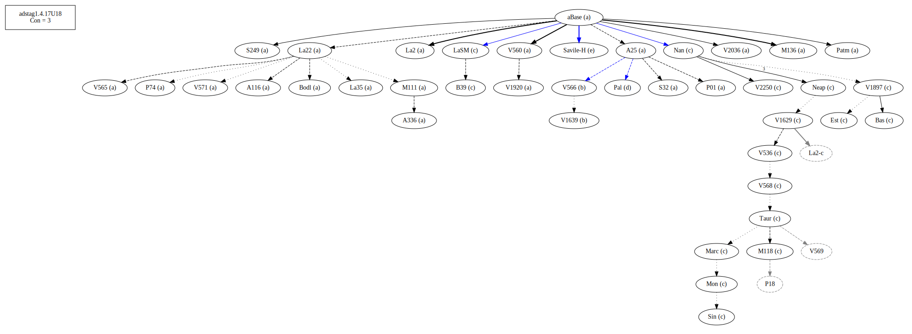
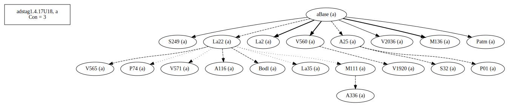
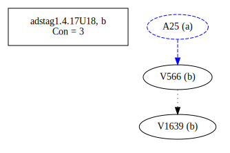
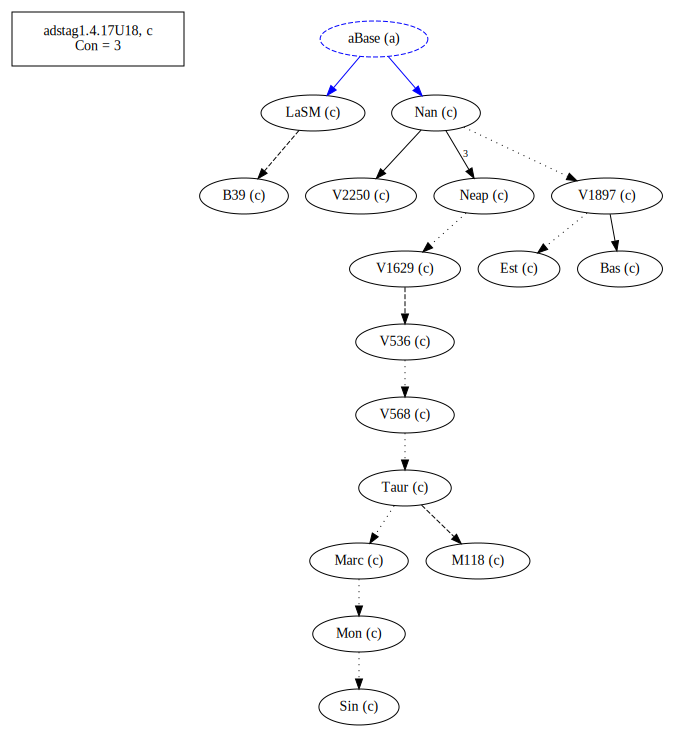
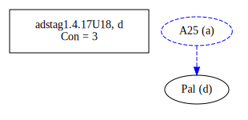
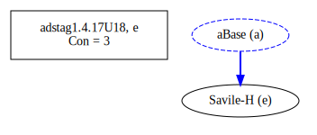
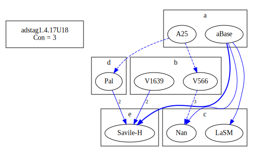
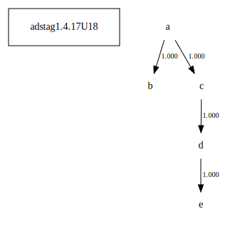

# Variant Analysis: AdStag1.4.17/18

Verb form (-αρεάζω)

## 📌 Variant Description
- **Location**: adstag1.4.17/18
- **Variant Units**: 
  - Reading A: ἐπηρεάσται
  - Reading B: ἐπιρέασται
  - Reading C: ἐπηρεάσθη
  - Reading D: ἐπηρεάσθαι
  - Reading E: ἐπηρεάζεσθαι

## 🧬 Manuscript Support
| Reading | Manuscripts | Notes |
|--------|-------------|-------|
| A      | A116 A25 A336 Bodl La2 La22 La35 M111 M136 P01 Patm S249 S32 V1639 V1920 V2036 V560 V565 V566 V571 |  |
| B      | V1639 V566 | |
| C      | V1897. V2250. Bas. LaSM. M118. Sin. Neap. Nan. V568. V536. Mon. V1629. B39. Est. Marc. Taur. | Editions |
| D      | Pal | [lone] |
| E      | Savile-H | [lone] |

## 🧠 Internal Evidence
- **Transcriptional Probability**: [e.g., Reading A is shorter and more difficult]
- **Stylistic/Contextual Fit**: [e.g., Reading B aligns with second sophistic style]

## 🧭 External Evidence
- **Manuscript Age**: [e.g., Reading A supported by earlier MSS]
- **Geographical Spread**: []

## 🔄 Directionality & Genealogy
- **Likely Original Reading**: [e.g., Reading A]
- **Genealogical Relationships**:
  - [e.g., B likely derived from A via harmonization]
  - [e.g., C appears to be a conflation of A and B]
## open-cbgm textual flow ##

## open-cbgm attestations ##

## open-cbgm flow limited to variant readings ##

## Local stemma ##

- **Contamination Notes**: [e.g., Manuscript F shows mixture of A and B]

## 📝 Notes & Decisions
- [Any additional observations, uncertainties, or decisions made]

---