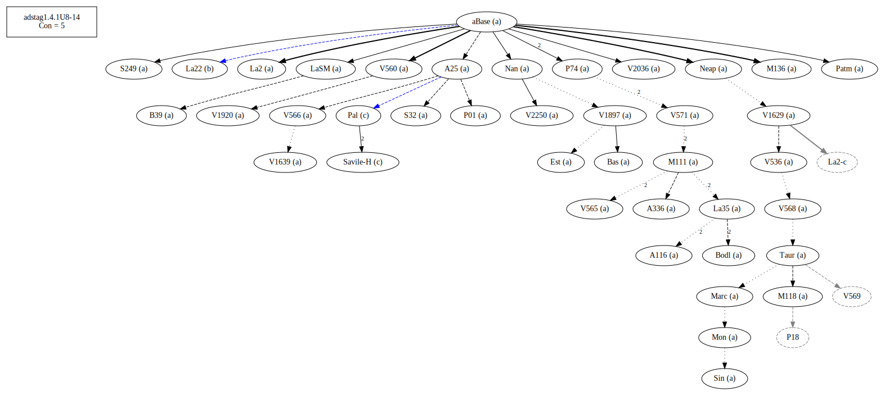
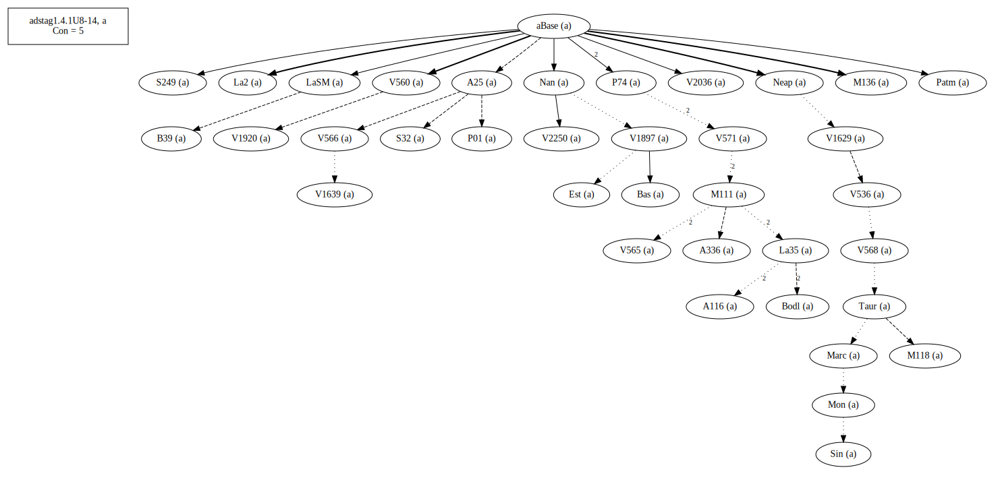
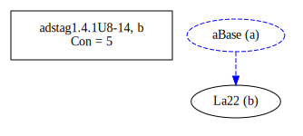
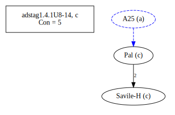
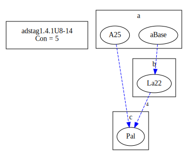
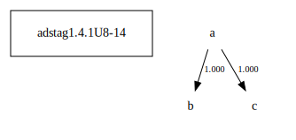

# Variant Analysis: AdStag1.4.1/8-14

## 📌 Variant Description
- **Variant unit**: adstag1.4.1/8-14

- **Variant Units**: 
  - Reading A: τις τίνος οὖν ἕνεκεν
  - Reading B: τις τίνος ἕνεκεν
  - Reading C: τις τίνος ἕνεκεν οὖν

## 🧬 Manuscript Support
| Reading | Manuscripts | Notes |
|--------|-------------|-------|
| A      | P74. V1897. V2250. A25. Bas. La35. LaSM. La2. Patm. S249. V1639. M118. P01. V565. V560. S32. M136. Sin. Neap. A336. A116. V1920. V2036. Nan. M111. V566. V568. aBase. La22-c. V536. Bodl. V571. Mon. V1629. B39. Est. Marc. Taur. | Migne |
| B      | La22 |  |
| C      | Pal | Savile |

## 🧠 Internal Evidence
- **Transcriptional Probability**: [e.g., Reading A is shorter and more difficult]
- **Stylistic/Contextual Fit**: [e.g., Reading B aligns with second sophistic style]

## 🧭 External Evidence
- **Manuscript Age**: [e.g., Reading A supported by earlier MSS]
- **Geographical Spread**: []

## 🔄 Directionality & Genealogy
- **Likely Original Reading**: [e.g., Reading A]
  - [e.g., B likely derived from A via harmonization]
  - [e.g., C appears to be a conflation of A and B]
  
## open-cbgm textual flow ##

## open-cbgm attestations ##

## open-cbgm flow limited to variant readings ##

## Local stemma ##

- **Contamination Notes**: [e.g., Manuscript F shows mixture of A and B]

## 📝 Notes & Decisions
- [Any additional observations, uncertainties, or decisions made]

---