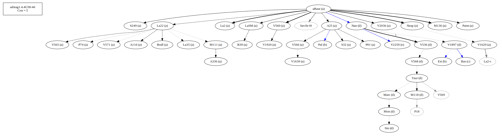
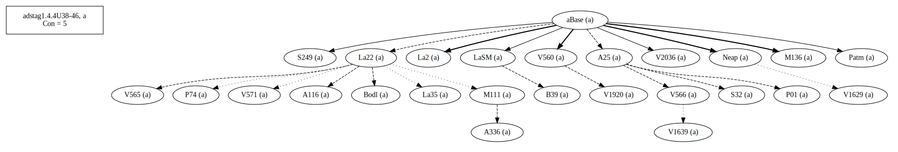
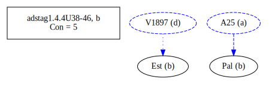
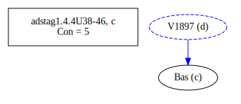
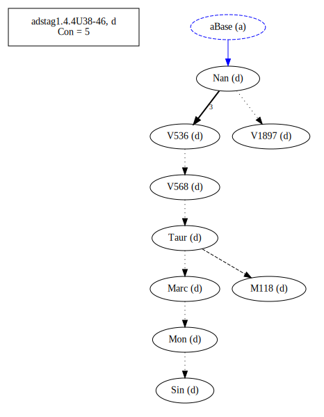
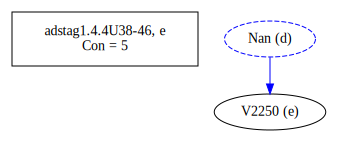
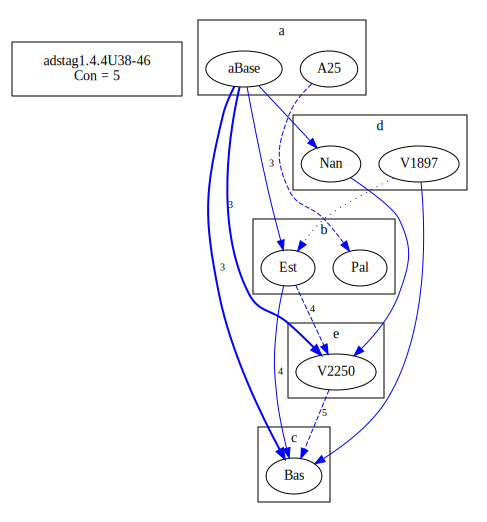
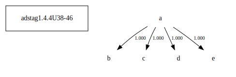

# Variant Analysis: AdStag1.4.4/38-46

Word order, verb choice. Not sure about not giving Bas priority.

## 📌 Variant Description
- **Location**: adstag1.4.4/38-46
- **Variant Units**: 
  - Reading A: τῆς εὐδοκιμέσεως τὴν πρόφασιν περιαιρεῖς
  - Reading B: τῆς εὐδοκιμήσεως τὴν πρόφασιν παραιρεῖς
  - Reading C: τῆς εὐδοκιμήσεως ταύτης τὴν πρόφασιν περιαιρεῖς
  - Reading D: τῆς εὐδοκιμήσεως τὴν πρόφασιν ἀναιρεῖς
  - Reading E: τὴν τῶν στεφάνων ἐκκόπτεις ὑπόθεσιν

## 🧬 Manuscript Support
| Reading | Manuscripts | Notes |
|--------|-------------|-------|
| A      | A116 A25 A336 B39 Bodl La2 La22 La35 LaSM M111 M136 Neap P01 P74 Patm S249 S32 V1629 V1920 V2036 V560 V565 V566 V571 | editions, coherence 90.95 |
| B      | Est Pal    | coherence 91.94 |
| C      | Bas | oldest |
| D      | M118 Marc Mon Nan Sin Taur V1897 V536 V568       | coherence 81.75 |
| E      | V2250 | lone, word order with next phrase in 50-58|

## 🧠 Internal Evidence
- **Transcriptional Probability**: [e.g., Reading A is shorter and more difficult]
- **Stylistic/Contextual Fit**: [e.g., Reading B aligns with second sophistic style]

## 🧭 External Evidence
- **Manuscript Age**: [e.g., Reading A supported by earlier MSS]
- **Geographical Spread**: []

## 🔄 Directionality & Genealogy
- **Likely Original Reading**: [e.g., Reading A]
- **Genealogical Relationships**:
  - [e.g., B likely derived from A via harmonization]
  - [e.g., C appears to be a conflation of A and B]
## open-cbgm textual flow ##

## open-cbgm attestations ##
      
      
      
      
      
## open-cbgm flow limited to variant readings ##

## Local stemma ##

- **Contamination Notes**: [e.g., Manuscript F shows mixture of A and B]

## 📝 Notes & Decisions
- Bas is oldest but there is a tight coherence in A. One can see a scribe behind Bas adding the demonstrative pronoun for emphasis. Note that V2250 has switched two phrases around. Note that even in messy situations the Taur-group sticks together coherently.

---